# KARM — Backend Architecture & Implementation Handoff

> **SIH:** SIH26130 — Efficiency in streamlining industrial approvals, compliance processes, and access to government support services  
> **Project:** KARM  
> **Backend owner:** Narendra  
> **Primary backend stack:** Node.js + MongoDB  
> **Frontend stack from the submitted material:** React.js + Tailwind CSS  
> **Deployment:** Docker  
> **Document purpose:** Single source of truth for the backend handoff, implementation plan, API contract, data model, Mermaid diagrams, security rules, and open decisions.

---

## 0. Important Source / Verification Note

This document is grounded in the three files supplied by the team:

1. `PRD.md`
2. `backend-architecture.md`
3. `domain-data-seed.md`

The supplied `backend-architecture.md` explicitly states that Django/Python were removed and that Node.js + MongoDB are the chosen backend direction. The PRD also confirms React.js + Tailwind CSS for the frontend, Node.js for the backend, MongoDB for the database, JWT role-based access, Gemini/OpenAI as the AI layer, and Docker for deployment.

**GitHub status:** The repository URL supplied for KARM was not accessible from the current web view and returned a 404 response. Therefore, this handoff does **not** claim to describe code that was inspected from the repository itself. It describes the backend that should be implemented from the supplied project documents.

Do not represent any item marked **[OPEN DECISION]**, **[RECOMMENDATION]**, or **[ILLUSTRATIVE]** as a confirmed requirement.

---

# 1. Project Scope

## 1.1 What Problem KARM Is Solving

The SIH problem is about **streamlining industrial approvals, compliance processes, and access to government support services**. The submitted PRD describes a situation where entrepreneurs and industrial units may have to deal with multiple registrations, permissions, licences, NOCs, inspections, and renewals across departments.

The practical problems identified by the project are:

```text
Problem 1
Applicants do not clearly know which approvals apply to their business.

Problem 2
Applicants may not know exactly which documents are required for each approval.

Problem 3
Incomplete or unsuitable documents create avoidable scrutiny/rework.

Problem 4
Applicants have poor visibility into where an application is stuck.

Problem 5
Authorities face repetitive scrutiny and incomplete applications.

Problem 6
There is limited visibility into approval bottlenecks and SLA delays.

Problem 7
Approval requirements can change, so a static checklist is difficult to maintain.
```

The PRD therefore defines KARM as a **dual-portal platform**:

- **Applicant Portal:** generates a personalized approval checklist, guides document submission, performs instant pre-validation, and provides application tracking.
- **Authority Portal:** provides a department-scoped review queue, document trust/risk signals, and human decision actions. fileciteturn0file2L10-L13

## 1.2 How KARM Solves the Problem

KARM does not attempt to replace the government approval authority. Its role is to organize and digitize the workflow around an application.

The solution is:

```text
BUSINESS INFORMATION
        ↓
PERSONALIZED CHECKLIST
        ↓
REQUIRED DOCUMENTS
        ↓
DOCUMENT PRE-VALIDATION
        ↓
COMPLETE APPLICATION
        ↓
DEPARTMENT-SCOPED AUTHORITY REVIEW
        ↓
AI-ASSISTED RISK BRIEF
        ↓
HUMAN DECISION
        ↓
SLA / STATUS TRACKING
```

This directly maps to the submitted four-step flow:

```text
Apply → Validate → Review → Track
```

The PRD defines these four stages as the core flow. fileciteturn0file2L31-L36

## 1.3 Supported Departments

KARM's initial department catalogue includes the following 10 departments and service areas:

1. **Revenue Department** — Land records, income/caste certificates, domicile certificates, and related services.
2. **Education Department** — Scholarships, student certificates, admissions, and education-related applications.
3. **Health Department** — Health certificates, medical assistance, health schemes, and related services.
4. **Transport Department** — Driving licences, vehicle registration, and transport-related services.
5. **Municipal Corporation / Urban Development Department** — Property-related services, building permissions, and local civic services.
6. **Social Welfare Department** — Welfare schemes, pensions, disability assistance, and social support applications.
7. **Labour Department** — Labour registrations, worker welfare schemes, and employment-related services.
8. **Agriculture Department** — Farmer schemes, subsidies, agricultural certificates, and assistance.
9. **Food & Civil Supplies Department** — Ration cards, food-supply services, and related applications.
10. **Police / Home Department** — Police verification, character certificates, permissions, and other police-related services.

Each department is represented by an active department record and can own approval types in the rules engine. Authorities are scoped to their assigned department and may review only applications containing approval items for that department.

## 1.4 What KARM Verifies vs What It Does Not Verify

This distinction is critical.

### KARM's backend can verify

```text
✓ User authentication
✓ User role
✓ Applicant ownership of an application
✓ Authority department access
✓ Business-profile fields
✓ Whether an approval is present in the active rules
✓ Required document presence
✓ File type
✓ File size
✓ Required fields / metadata
✓ Expiry-date conditions where applicable
✓ Application status transitions
✓ SLA deadlines
✓ Whether an officer is authorized to act
✓ Whether a decision has the required reason
✓ Audit history
```

### KARM's AI/document layer can assist with

```text
→ Risk signals
→ Summary
→ Flags
```

The supplied design explicitly says the AI output is advisory and that the human officer makes the final decision. fileciteturn0file1L139-L143

### KARM does NOT automatically decide

```text
✗ Final approval
✗ Final rejection
✗ Legal/regulatory truth of an unverified seed rule
✗ Government eligibility based only on an AI answer
```

The final approval/rejection remains a human authority action.

---

# 2. Complete KARM User Flow

## 2.1 End-to-End User Flow

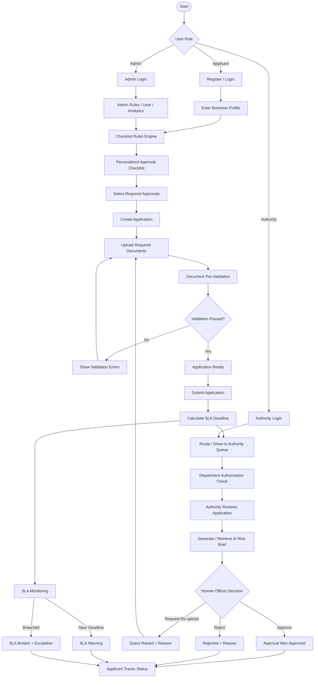
```mermaid
flowchart TD
    START([Start]) --> ROLE{User Role}

    ROLE -->|Applicant| REG[Register / Login]
    ROLE -->|Authority| LOGIN_A[Authority Login]
    ROLE -->|Admin| LOGIN_AD[Admin Login]

    REG --> PROFILE[Enter Business Profile]
    PROFILE --> RULES[Checklist Rules Engine]

    RULES --> CHECK[Personalized Approval Checklist]
    CHECK --> SELECT[Select Required Approvals]
    SELECT --> CREATE[Create Application]

    CREATE --> DOCS[Upload Required Documents]
    DOCS --> VALIDATE[Document Pre-Validation]

    VALIDATE --> VALID{Validation Passed?}
    VALID -->|No| ERRORS[Show Validation Errors]
    ERRORS --> DOCS

    VALID -->|Yes| READY[Application Ready]
    READY --> SUBMIT[Submit Application]

    SUBMIT --> SLA[Calculate SLA Deadline]
    SLA --> QUEUE[Route / Show in Authority Queue]

    LOGIN_A --> QUEUE
    QUEUE --> DEPT[Department Authorization Check]
    DEPT --> REVIEW[Authority Reviews Application]

    REVIEW --> RISK[Generate / Retrieve AI Risk Brief]
    RISK --> DECISION{Human Officer Decision}

    DECISION -->|Approve| APPROVED[Approval Item Approved]
    DECISION -->|Reject| REJECTED[Rejected + Reason]
    DECISION -->|Request Re-upload| QUERY[Query Raised + Reason]

    QUERY --> DOCS

    APPROVED --> TRACK[Applicant Tracks Status]
    REJECTED --> TRACK

    SLA --> MONITOR[SLA Monitoring]
    MONITOR -->|Near Deadline| WARNING[SLA Warning]
    MONITOR -->|Breached| BREACH[SLA Breach + Escalation]

    WARNING --> TRACK
    BREACH --> TRACK

    LOGIN_AD --> ADMIN[Admin Rules / User / Analytics]
    ADMIN --> RULES
```

---

# 3. Applicant Journey — Step by Step

## Step 1 — Registration / Login

The applicant creates an account and receives a JWT after successful authentication.

```text
Applicant
   ↓
POST /auth/register
   ↓
User created with role = applicant
   ↓
POST /auth/login
   ↓
JWT issued
```

The JWT is then sent with protected requests:

```http
Authorization: Bearer <token>
```

---

## Step 2 — Business Profile

The applicant provides the information used by the checklist engine.

Current model:

```text
Business Name
Sector
State
District
Project Size
Stage
```

The PRD confirms that the checklist is based on sector, location, and project size. The backend model also contains `stage`, but the supplied source does not define exactly how `stage` affects checklist matching. fileciteturn0file1L29-L39

---

# 4. How the Checklist Is Generated

This is one of the most important parts of KARM.

KARM should **not** simply show one hard-coded list of approvals to every applicant.

Instead:

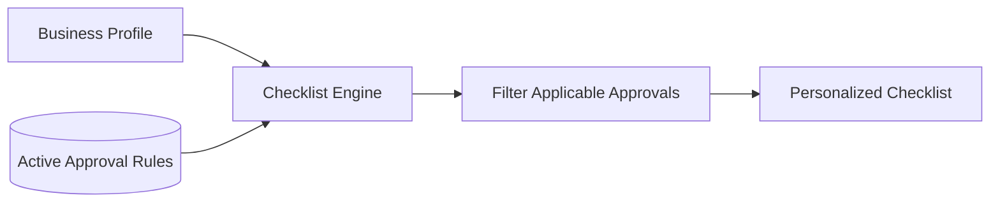
```mermaid
flowchart LR
    P[Business Profile] --> E[Checklist Engine]
    R[(Active Approval Rules)] --> E
    E --> F[Filter Applicable Approvals]
    F --> C[Personalized Checklist]
```

Conceptually:

```text
Business Profile
       +
Active Approval Rules
       ↓
Rules Engine
       ↓
Applicable Approval Types
       ↓
Personalized Checklist
```

Example:

```text
Profile
Sector = Manufacturing
Location = Maharashtra / District X
Project Size = Small

             ↓

Rules Engine

             ↓

Approval A
Approval B
Approval C
Approval D
```

The exact production rule taxonomy has **not** been established in the supplied material. The provided seed data explicitly calls its examples illustrative/demo data, not verified regulatory requirements. fileciteturn0file0L1-L3

Therefore, the backend should make the rules configurable rather than hard-code them into controllers.

---

# 5. What Happens When an Application Is Created?

The applicant selects applicable approval types and creates an application.

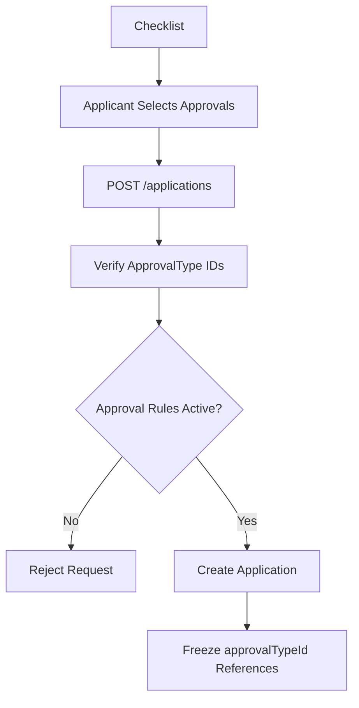
```mermaid
flowchart TD
    C[Checklist] --> S[Applicant Selects Approvals]
    S --> API[POST /applications]
    API --> VERIFY[Verify ApprovalType IDs]
    VERIFY --> ACTIVE{Approval Rules Active?}
    ACTIVE -->|No| ERROR[Reject Request]
    ACTIVE -->|Yes| SNAP[Create Application]
    SNAP --> FREEZE[Freeze approvalTypeId References]
```

The backend should verify that the requested approval IDs exist and are active before creating the application.

Once created, the application's selected `approvalTypeId` references are frozen. This means future rule changes do not silently alter an application that is already in progress. fileciteturn0file1L77-L77

---

# 6. Document Verification Flow

This is the second major part of KARM.

For each approval item, the backend knows which documents are required.

```text
ApprovalType
    ↓
requiredDocuments[]
    ↓
Applicant uploads document
```

## Verification pipeline

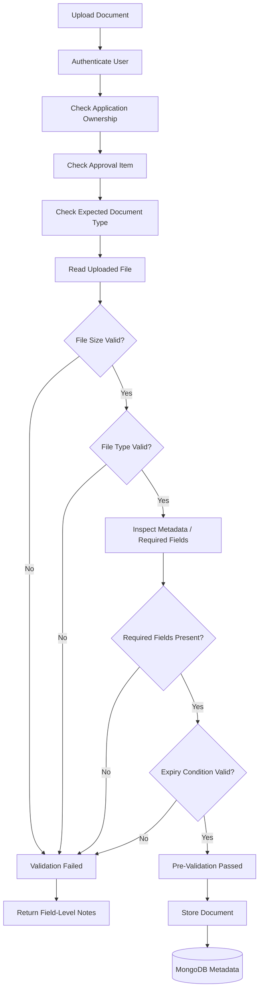
```mermaid
flowchart TD
    UP[Upload Document] --> AUTH[Authenticate User]
    AUTH --> OWN[Check Application Ownership]
    OWN --> ITEM[Check Approval Item]
    ITEM --> TYPE[Check Expected Document Type]
    TYPE --> FILE[Read Uploaded File]

    FILE --> SIZE{File Size Valid?}
    SIZE -->|No| FAIL[Validation Failed]
    SIZE -->|Yes| FORMAT{File Type Valid?}

    FORMAT -->|No| FAIL
    FORMAT -->|Yes| META[Inspect Metadata / Required Fields]

    META --> REQUIRED{Required Fields Present?}
    REQUIRED -->|No| FAIL
    REQUIRED -->|Yes| EXPIRY{Expiry Condition Valid?}

    EXPIRY -->|No| FAIL
    EXPIRY -->|Yes| PASS[Pre-Validation Passed]

    FAIL --> NOTES[Return Field-Level Notes]
    PASS --> STORE[Store Document]
    STORE --> DB[(MongoDB Metadata)]
```

The supplied backend architecture explicitly identifies file type, file size, expiry-date checks, and required-field presence as the pre-validation scope. fileciteturn0file1L139-L140

### Important

A passed pre-validation means:

> **The document passed the system's defined technical/preliminary checks.**

It does **not** mean:

> **The government authority has approved the document or application.**

---

# 7. What If a Document Fails?

Example:

```text
Required:
PAN Card

Uploaded:
Unsupported file / missing required information
```

Backend returns something like:

```json
{
  "preValidationStatus": "failed",
  "preValidationNotes": [
    "Required field is missing"
  ]
}
```

The frontend can immediately show the problem.

Flow:

```text
Upload
  ↓
Validation Failed
  ↓
Show reason
  ↓
Applicant fixes document
  ↓
Upload again
  ↓
Validation
```

This addresses the project's problem of incomplete applications before they reach authority review.

---

# 8. Application Submission

Only after the required documents have passed the application's defined validation flow should the application be submitted.

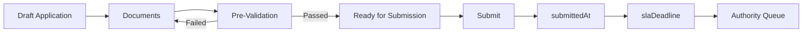
```mermaid
flowchart LR
    A[Draft Application] --> D[Documents]
    D --> V[Pre-Validation]
    V -->|Failed| D
    V -->|Passed| READY[Ready for Submission]
    READY --> SUB[Submit]
    SUB --> TIME[submittedAt]
    TIME --> SLA[slaDeadline]
    SLA --> QUEUE[Authority Queue]
```

On submission, the backend calculates:

```text
slaDeadline = submittedAt + approvalType.slaDays
```

The supplied architecture explicitly defines this calculation. fileciteturn0file1L57-L70

---

# 9. How Does the Application Reach the Correct Authority?

The `ApprovalType` contains a department.

```text
Application
   ↓
Approval Item
   ↓
ApprovalType
   ↓
Department
   ↓
Authority Queue
```

Example conceptually:

```text
Approval Item
     ↓
department = Department X
     ↓
Only authorized officers for Department X
can access that item through the authority API.
```

This is not just a frontend filter.

The backend must enforce:

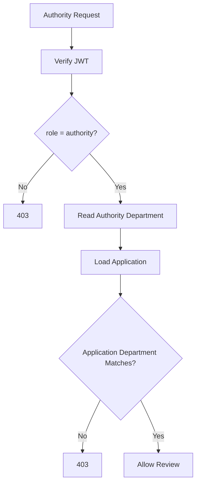
```mermaid
flowchart TD
    REQ[Authority Request] --> JWT[Verify JWT]
    JWT --> ROLE{role = authority?}
    ROLE -->|No| DENY1[403]
    ROLE -->|Yes| DEPT[Read Authority Department]
    DEPT --> APP[Load Application]
    APP --> MATCH{Application Department Matches?}
    MATCH -->|No| DENY2[403]
    MATCH -->|Yes| ACCESS[Allow Review]
```

The source explicitly requires authorities to access only applications routed to their department. fileciteturn0file1L13-L14

---

# 10. Authority Review

The authority sees:

```text
Application
├── Applicant/business information
├── Approval item
├── Required documents
├── Uploaded documents
├── Pre-validation results
├── SLA status
├── AI risk brief
└── Previous history
```

The authority then makes the actual decision.

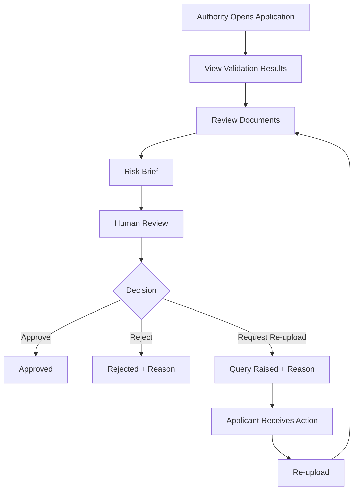
```mermaid
flowchart TD
    A[Authority Opens Application] --> V[View Validation Results]
    V --> D[Review Documents]
    D --> R[Risk Brief]
    R --> H[Human Review]
    H --> DEC{Decision}

    DEC -->|Approve| AP[Approved]
    DEC -->|Reject| RE[Rejected + Reason]
    DEC -->|Request Re-upload| QR[Query Raised + Reason]

    QR --> APPLICANT[Applicant Receives Action]
    APPLICANT --> UPLOAD[Re-upload]
    UPLOAD --> D
```

---

# 11. How AI Verification Works

The project calls for a layered document trust check:

```text
Metadata / Pre-validation
          ↓
AI Risk Brief
          ↓
Human Authority Review
```

The AI layer produces:

```json
{
  "score": 0,
  "summary": "...",
  "flags": [],
  "generatedAt": "..."
}
```

The supplied architecture defines the stored risk-brief shape as score, summary, flags, and generation time. fileciteturn0file1L65-L70

## What AI should do

```text
AI
 ↓
Analyze permitted document information
 ↓
Identify potential risk signals
 ↓
Produce summary
 ↓
Produce flags
 ↓
Return advisory result
```

## What AI should NOT do

```text
AI
 ↓
"APPROVE APPLICATION"
```

That is not the intended design.

Instead:

```text
AI says:
"Potential issue detected"

        ↓

Officer investigates

        ↓

Officer decides:
Approve / Reject / Request Re-upload
```

The PRD explicitly states that AI only flags risk and the human officer always makes the final decision. fileciteturn0file2L22-L29

---

# 12. Re-upload / Query Flow

Suppose the authority finds a problem.

```text
Authority
   ↓
Request Re-upload
   ↓
Reason is mandatory
   ↓
Application Item = query_raised
   ↓
Applicant sees action required
   ↓
Applicant uploads corrected document
   ↓
Pre-validation runs again
   ↓
Authority reviews again
```

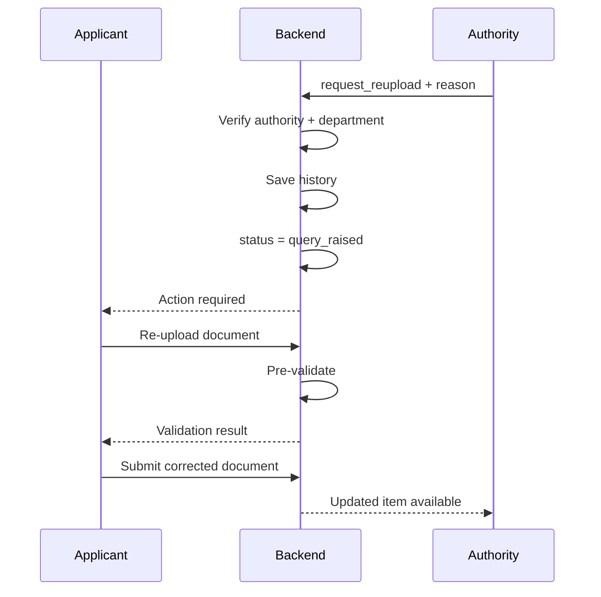
```mermaid
sequenceDiagram
    participant A as Applicant
    participant API as Backend
    participant O as Authority

    O->>API: request_reupload + reason
    API->>API: Verify authority + department
    API->>API: Save history
    API->>API: status = query_raised
    API-->>A: Action required

    A->>API: Re-upload document
    API->>API: Pre-validate
    API-->>A: Validation result

    A->>API: Submit corrected document
    API-->>O: Updated item available
```

The supplied API contract allows re-upload when the item is in `query_raised` or `rejected`. fileciteturn0file1L119-L121

---

# 13. How KARM Solves the "Where Is My Application?" Problem

Without a centralized workflow, an applicant may not have one clear place to understand:

```text
What approval is pending?
Which department has it?
What document is required?
Was the document accepted?
How long has it been pending?
Was a query raised?
What action is required?
```

KARM stores the application lifecycle and exposes it through the applicant dashboard.

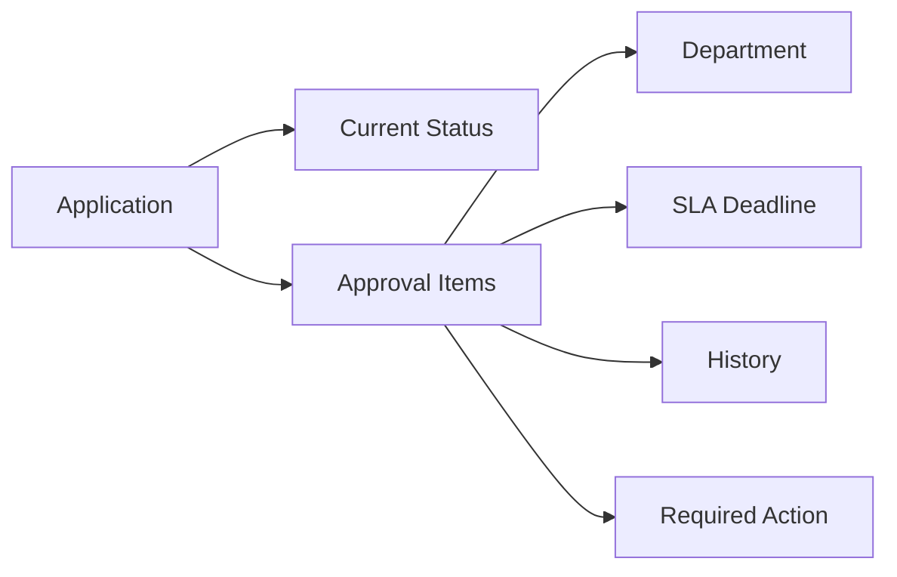
```mermaid
flowchart LR
    APP[Application] --> STATUS[Current Status]
    APP --> ITEMS[Approval Items]
    ITEMS --> DEPT[Department]
    ITEMS --> SLA[SLA Deadline]
    ITEMS --> HISTORY[History]
    ITEMS --> ACTION[Required Action]
```

Therefore the dashboard can answer:

```text
Current state
     +
Pending approval
     +
Department
     +
Required action
     +
SLA information
     +
History
```

The PRD specifically requires a live "Days Pending Approval" tracker and SLA visibility until resolution. fileciteturn0file2L22-L28

---

# 14. SLA Verification

After submission:

```text
submittedAt = 6 Oct
slaDays = 10

↓
slaDeadline = 16 Oct
```

The backend scheduler checks active items.

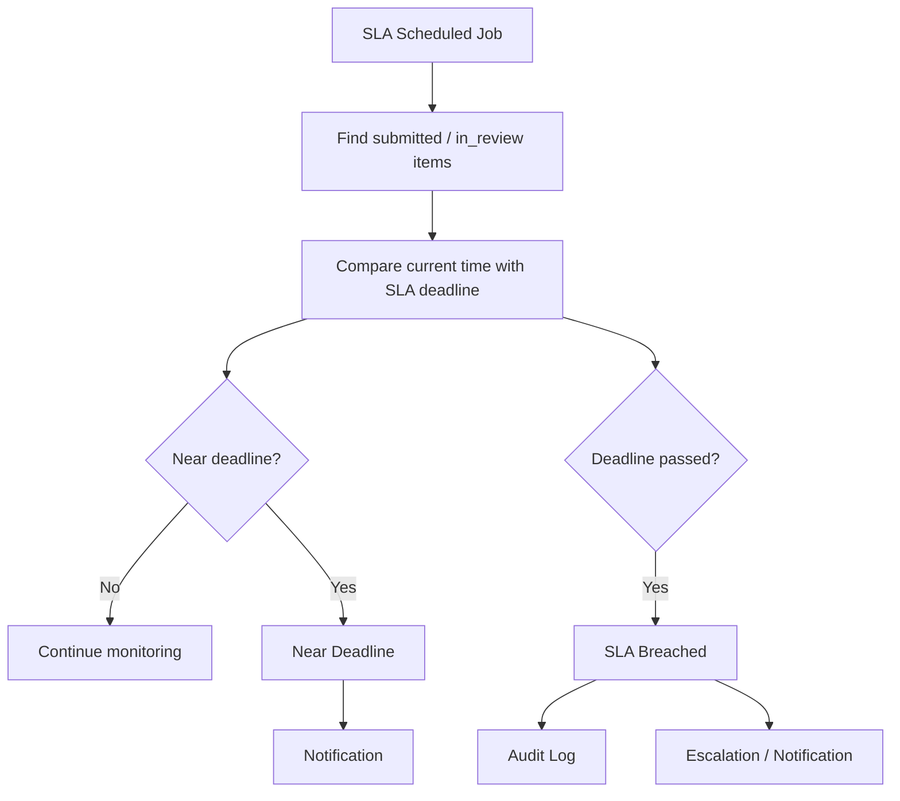
```mermaid
flowchart TD
    CRON[SLA Scheduled Job] --> FIND[Find submitted / in_review items]
    FIND --> CHECK[Compare current time with SLA deadline]

    CHECK --> NORMAL{Near deadline?}
    NORMAL -->|No| WAIT[Continue monitoring]

    NORMAL -->|Yes| AMBER[Near Deadline]
    AMBER --> NOTIFY[Notification]

    CHECK --> BREACHED{Deadline passed?}
    BREACHED -->|Yes| RED[SLA Breached]
    RED --> AUDIT[Audit Log]
    RED --> ESC[Escalation / Notification]
```

The source confirms nearing-deadline and breached states, but the exact frequency, warning window, and supervisor hierarchy are still open decisions. fileciteturn0file1L145-L148

---

# 15. How the Complete Problem/Solution Maps Together

| Problem | KARM mechanism | Result |
|---|---|---|
| Applicant doesn't know applicable approvals | Rules-based personalized checklist | Clear list of approval items |
| Applicant doesn't know required documents | `ApprovalType.requiredDocuments` | Guided document submission |
| Incomplete documents reach scrutiny | Pre-validation | Problems identified before submission |
| Applicant doesn't know status | Application status + history | Centralized tracking |
| Department queues are difficult to manage | Department-scoped authority API | Relevant applications reach the correct authority view |
| Repetitive document scrutiny | Pre-validation + AI risk brief | Review is assisted |
| AI could make an incorrect decision | Human officer remains final decision-maker | AI remains advisory |
| SLA delays are difficult to see | `slaDeadline` + scheduled checks | Nearing/breached applications can be flagged |
| Rules change over time | Admin-managed `ApprovalType` rules | Checklist logic can be updated without changing application code |
| Need accountability | History + global AuditLog | Actions are recorded |

The PRD itself identifies these core requirements: personalized checklist, guided validation, SLA tracking, authority decisions, AI-assisted trust checks, role-based access, and admin-managed rules. fileciteturn0file2L22-L29

---

# 16. One Simple Explanation of KARM

If the project needs to be explained quickly:

> **KARM is a workflow platform that helps businesses understand which industrial approvals they need, prepare the required documents correctly, submit applications, and track them through review. Authorities get a department-specific review queue with document validation and AI-assisted risk signals, while the final approval decision remains with the human officer.**

```text
BEFORE KARM

Business
  ├── "Which approvals do I need?"
  ├── "Which documents?"
  ├── "Did they receive my application?"
  ├── "Why is it pending?"
  └── "What do I need to fix?"

            ↓

        KARM

Profile
  ↓
Checklist
  ↓
Documents
  ↓
Validation
  ↓
Submission
  ↓
Authority Review
  ↓
AI Risk Assistance
  ↓
Human Decision
  ↓
SLA Tracking
  ↓
Resolution
```

---

# 17. Critical Verification Principle

The backend should always distinguish between these four levels:

```text
LEVEL 1 — DATA VALIDATION
"Is the request structurally valid?"

LEVEL 2 — DOCUMENT PRE-VALIDATION
"Does the uploaded document satisfy the defined preliminary checks?"

LEVEL 3 — AI RISK ASSISTANCE
"Are there signals the officer should investigate?"

LEVEL 4 — GOVERNMENT / AUTHORITY DECISION
"Is this approval actually granted?"
```

Only Level 4 is the final approval decision.

This separation is important for both the architecture and the SIH explanation.

---


## 1.1 Problem

KARM is intended to simplify industrial approvals and compliance for entrepreneurs and industrial units by making applicable approvals, documents, submission status, scrutiny, and SLA visibility easier to manage.

The submitted solution defines four core stages:

**Apply → Validate → Review → Track**

## 1.2 User Roles

| Role | Main responsibility | Backend access |
|---|---|---|
| Applicant | Create profile, receive checklist, upload documents, submit applications, track progress | Own records only |
| Authority | Review applications routed to their department | Department-scoped queue |
| Department Admin | Manage services, required documents, authorities, and department applications | Assigned department only |
| Admin | Maintain approval rules and manage platform configuration | Administrative access |

The backend must enforce authorization server-side. Frontend route protection alone is not sufficient.

---

# 3. Recommended Repository Structure

## Recommendation: Keep Frontend and Backend Separate

Use a single Git repository with separate application folders:

```text
KARM/
├── frontend/
├── backend/
├── docs/
├── uploads/
├── .gitignore
├── docker-compose.yml
└── README.md
```

### Why this is the better structure

The submitted technology decision already separates the frontend and backend technologies. Keeping them in separate folders gives you:

- Independent dependency management
- Independent deployment/build processes
- Clear ownership between frontend and backend work
- Easier Docker configuration
- Less accidental coupling
- Cleaner GitHub collaboration

Avoid putting React code inside the Node.js backend folder.

### Suggested ownership

```text
frontend/  -> Friend / frontend owner
backend/   -> Narendra / backend owner
docs/      -> Shared architecture + project documentation
```

---

# 4. Backend Folder Structure

The following structure is a practical **recommended implementation structure**, not a structure confirmed to already exist in the GitHub repository.

```text
backend/
├── src/
│   ├── config/
│   │   ├── db.js
│   │   ├── env.js
│   │   └── ai.js
│   │
│   ├── models/
│   │   ├── User.js
│   │   ├── BusinessProfile.js
│   │   ├── ApprovalType.js
│   │   ├── Application.js
│   │   ├── Notification.js
│   │   └── AuditLog.js
│   │
│   ├── controllers/
│   │   ├── auth.controller.js
│   │   ├── profile.controller.js
│   │   ├── checklist.controller.js
│   │   ├── application.controller.js
│   │   ├── authority.controller.js
│   │   └── admin.controller.js
│   │
│   ├── routes/
│   │   ├── auth.routes.js
│   │   ├── profile.routes.js
│   │   ├── checklist.routes.js
│   │   ├── application.routes.js
│   │   ├── authority.routes.js
│   │   └── admin.routes.js
│   │
│   ├── middleware/
│   │   ├── auth.middleware.js
│   │   ├── role.middleware.js
│   │   ├── ownership.middleware.js
│   │   ├── department.middleware.js
│   │   ├── upload.middleware.js
│   │   ├── validate.middleware.js
│   │   └── error.middleware.js
│   │
│   ├── services/
│   │   ├── auth.service.js
│   │   ├── checklist.service.js
│   │   ├── application.service.js
│   │   ├── document.service.js
│   │   ├── validation.service.js
│   │   ├── ai-risk.service.js
│   │   ├── sla.service.js
│   │   ├── notification.service.js
│   │   └── audit.service.js
│   │
│   ├── utils/
│   │   ├── jwt.js
│   │   ├── hash.js
│   │   ├── dates.js
│   │   └── logger.js
│   │
│   ├── jobs/
│   │   └── sla.job.js
│   │
│   ├── seeds/
│   │   ├── approvalTypes.seed.js
│   │   └── checklistRules.seed.js
│   │
│   ├── app.js
│   └── server.js
│
├── tests/
│   ├── auth.test.js
│   ├── profile.test.js
│   ├── checklist.test.js
│   ├── applications.test.js
│   ├── authority.test.js
│   └── admin.test.js
│
├── uploads/
│   └── .gitkeep
│
├── .env.example
├── .gitignore
├── Dockerfile
├── package.json
└── README.md
```

## Layer responsibilities

### `routes/`
Only defines HTTP endpoints and connects them to middleware/controllers.

### `controllers/`
Receives the HTTP request, validates/normalizes input through the middleware, calls services, and returns HTTP responses.

### `services/`
Contains business logic. Checklist generation, application state transitions, validation, AI calls, SLA calculations, notifications, and audit logging should live here rather than inside route files.

### `models/`
Contains Mongoose schemas and indexes.

### `middleware/`
Contains authentication, role checks, ownership checks, department checks, file handling, validation, and error handling.

### `jobs/`
Contains scheduled work such as the SLA scan.

### `seeds/`
Contains demo data only. Do not treat the current seed taxonomy as authoritative government data.

---

# 5. High-Level Backend Architecture

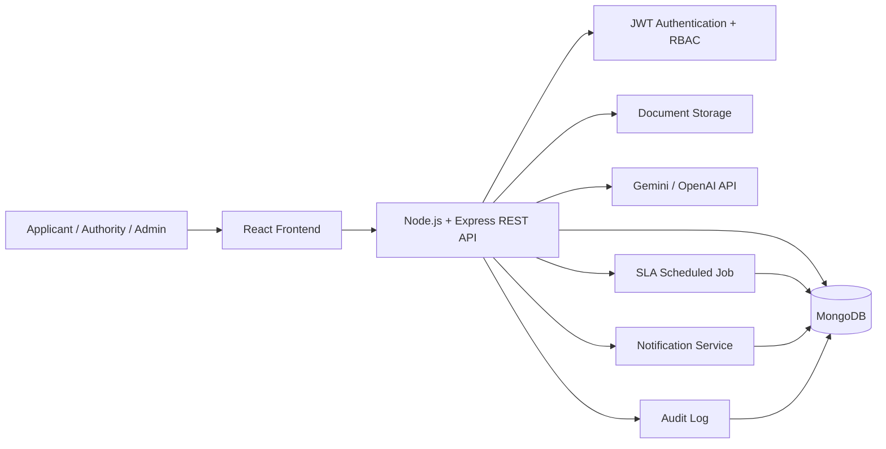
```mermaid
flowchart LR
    U[Applicant / Authority / Admin] --> F[React Frontend]
    F --> API[Node.js + Express REST API]
    API --> AUTH[JWT Authentication + RBAC]
    API --> DB[(MongoDB)]
    API --> FILES[Document Storage]
    API --> AI[Gemini / OpenAI API]
    API --> JOB[SLA Scheduled Job]
    JOB --> DB
    API --> NOTIFY[Notification Service]
    API --> AUDIT[Audit Log]
    NOTIFY --> DB
    AUDIT --> DB
```

### Request path

```text
Browser
  ↓
React frontend
  ↓ HTTP/JSON / multipart
Node.js + Express
  ↓
Authentication / Authorization
  ↓
Controller
  ↓
Service / business logic
  ↓
MongoDB / File storage / AI provider
  ↓
Response
```

---

# 6. Core Functional Flow

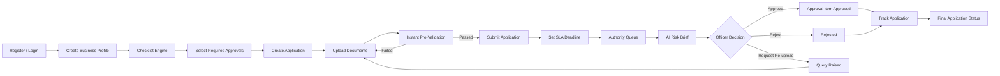
```mermaid
flowchart LR
    A[Register / Login] --> B[Create Business Profile]
    B --> C[Checklist Engine]
    C --> D[Select Required Approvals]
    D --> E[Create Application]
    E --> F[Upload Documents]
    F --> G[Instant Pre-Validation]
    G -->|Failed| F
    G -->|Passed| H[Submit Application]
    H --> I[Set SLA Deadline]
    I --> J[Authority Queue]
    J --> K[AI Risk Brief]
    K --> L{Officer Decision}
    L -->|Approve| M[Approval Item Approved]
    L -->|Reject| N[Rejected]
    L -->|Request Re-upload| O[Query Raised]
    O --> F
    M --> P[Track Application]
    N --> P
    P --> Q[Final Application Status]
```

---

# 7. Authentication and Authorization

## 6.1 JWT

The supplied backend design uses:

- JSON Web Tokens
- `jsonwebtoken`
- `bcrypt` password hashing

JWT should carry the user's role and identity information needed to authorize requests.

Conceptual payload:

```json
{
  "sub": "USER_ID",
  "role": "applicant",
  "department": null
}
```

Authority users should carry a department.

## 6.2 Authorization rules

### Applicant

Can:

- Read/update own profile
- Read own checklist
- Create own applications
- Read own applications
- Upload documents for own applications
- Re-upload documents when allowed
- Track own application status

Must not be able to:

- Read another applicant's application
- Access authority queues
- Change approval rules
- Make authority decisions

### Authority

Can:

- Read applications routed to their department
- Review application items
- Read risk briefs
- Approve
- Reject with reason
- Request re-upload with reason

Must not be able to:

- Access applications belonging to unrelated departments
- Modify admin-managed approval rules

### Admin

Can:

- Manage approval types
- List/manage users according to the implemented admin scope
- View analytics
- Maintain the checklist/rules data

---

# 8. Authorization Middleware

Every protected endpoint should follow this conceptual chain:

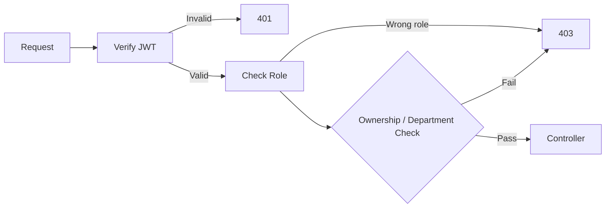
```mermaid
flowchart LR
    R[Request] --> T[Verify JWT]
    T -->|Invalid| U[401]
    T -->|Valid| ROLE[Check Role]
    ROLE -->|Wrong role| F[403]
    ROLE --> O{Ownership / Department Check}
    O -->|Fail| F
    O -->|Pass| C[Controller]
```

The server must enforce both:

1. **Role authorization**
2. **Resource-level authorization**

Do not rely on a frontend route guard as the security boundary.

---

# 9. Data Model

## 8.1 User

```js
{
  _id,
  name,
  email,
  passwordHash,
  role,
  department,
  phone,
  createdAt,
  updatedAt
}
```

`role`:

```text
applicant
authority
admin
```

---

## 8.2 BusinessProfile

```js
{
  _id,
  userId,
  businessName,
  sector,
  location: {
    state,
    district
  },
  projectSize,
  stage,
  createdAt,
  updatedAt
}
```

One applicant has one business profile according to the supplied design.

---

## 8.3 ApprovalType

```js
{
  _id,
  name,
  department,
  requiredDocuments: [
    {
      docType,
      label,
      required
    }
  ],
  slaDays,
  description,
  isActive,
  createdAt,
  updatedAt
}
```

Approval types are admin-managed rules.

---

## 8.4 Application

```js
{
  _id,
  applicantId,
  businessProfileId,

  approvalItems: [
    {
      _id,
      approvalTypeId,

      status,
      assignedOfficerId,
      submittedAt,
      slaDeadline,

      documents: [
        {
          docType,
          fileUrl,
          uploadedAt,
          preValidationStatus,
          preValidationNotes,

          riskBrief: {
            score,
            summary,
            flags,
            generatedAt
          }
        }
      ],

      history: [
        {
          action,
          byUserId,
          byRole,
          reason,
          timestamp
        }
      ]
    }
  ],

  overallStatus,

  createdAt,
  updatedAt
}
```

### Application item status

```text
draft
submitted
in_review
query_raised
approved
rejected
```

### Overall application status

```text
draft
in_progress
action_required
approved
rejected
```

The supplied architecture states that `overallStatus` is derived from `approvalItems`.

---

# 10. Checklist Snapshot Rule

The checklist should be calculated from the current business profile against active approval rules.

When an application is created:

```text
BusinessProfile
      ↓
Active ApprovalType rules
      ↓
Checklist
      ↓
Applicant selects approvals
      ↓
Application created
      ↓
approvalTypeId values are frozen
```

This prevents a later admin rule edit from silently changing requirements for an already-created application.

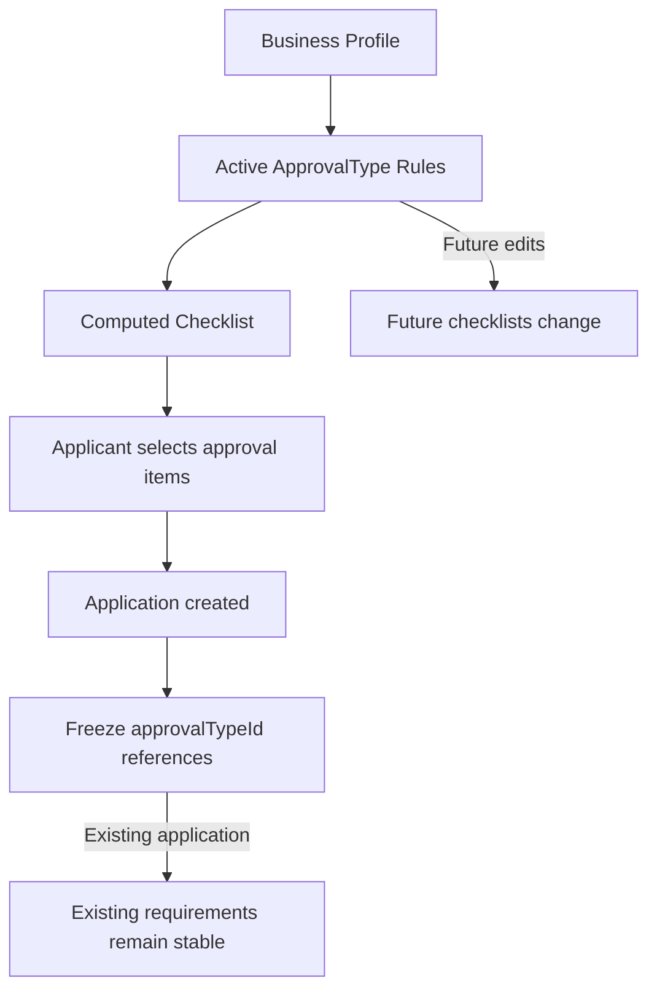
```mermaid
flowchart TD
    BP[Business Profile] --> RULES[Active ApprovalType Rules]
    RULES --> CHECK[Computed Checklist]
    CHECK --> SELECT[Applicant selects approval items]
    SELECT --> APP[Application created]
    APP --> SNAP[Freeze approvalTypeId references]
    RULES -->|Future edits| NEW[Future checklists change]
    SNAP -->|Existing application| EXISTING[Existing requirements remain stable]
```

---

# 11. Checklist Engine

## Confirmed dimensions

The PRD specifies that the personalized checklist is based on:

- Sector
- Location
- Project size

The `BusinessProfile` model also contains `stage`, but the exact matching logic involving `stage` was not defined.

### Recommended MVP implementation

Use a simple deterministic rules engine first.

```text
BusinessProfile
    ↓
Filter active ApprovalType rules
    ↓
Apply sector/location/project-size conditions
    ↓
Return applicable approval types
```

Do not build a complex AI rules engine for the MVP.

### Important data warning

`domain-data-seed.md` explicitly says its approval taxonomy and mapping examples are illustrative demo/dev seed data and are **not verified government regulatory content**.

Do not present those example approvals as official Maharashtra requirements.

---

# 12. Document Upload and Pre-Validation

The PRD requires guided document upload with instant pre-validation.

The supplied backend design identifies these validation checks:

1. File type
2. File size
3. Expiry date
4. Required-field presence

The source material does **not** define the exact OCR/extraction implementation.

## Recommended request flow

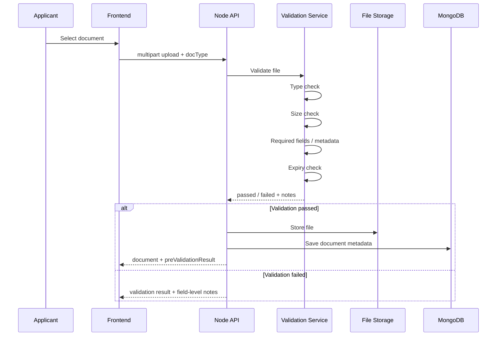
```mermaid
sequenceDiagram
    participant A as Applicant
    participant F as Frontend
    participant API as Node API
    participant V as Validation Service
    participant S as File Storage
    participant DB as MongoDB

    A->>F: Select document
    F->>API: multipart upload + docType
    API->>V: Validate file
    V->>V: Type check
    V->>V: Size check
    V->>V: Required fields / metadata
    V->>V: Expiry check
    V-->>API: passed / failed + notes

    alt Validation passed
        API->>S: Store file
        API->>DB: Save document metadata
        API-->>F: document + preValidationResult
    else Validation failed
        API-->>F: validation result + field-level notes
    end
```

### Important distinction

Pre-validation is **not approval**.

```text
Pre-validation = "Is this document suitable enough to proceed?"
Human authority decision = "Should this approval be granted?"
```

---

# 13. File Storage

The supplied design leaves storage as an open decision.

## Recommended MVP decision

Use an abstraction so the rest of the backend does not depend directly on the storage provider:

```text
document.service.js
       ↓
storage adapter
       ├── local disk for local development/demo
       └── object storage adapter for deployment/production
```

Do not commit uploaded applicant documents to Git.

Do not put uploaded document binaries directly into normal MongoDB documents unless the team deliberately chooses a database-file strategy.

### Suggested configuration shape

```env
FILE_STORAGE_PROVIDER=local
FILE_STORAGE_PATH=./uploads
```

When changing to an object-storage provider, only the storage adapter/configuration should need to change.

---

# 14. AI Risk Brief

The supplied design allows Gemini or OpenAI for document risk summaries.

## Flow

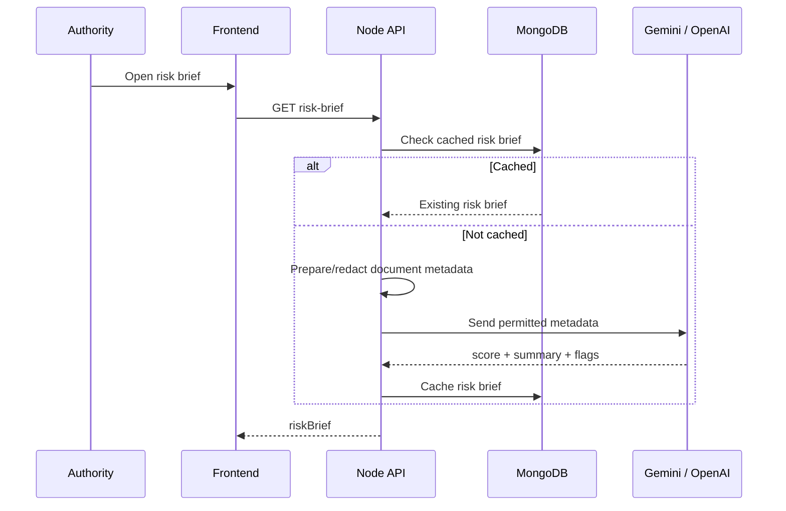
```mermaid
sequenceDiagram
    participant O as Authority
    participant F as Frontend
    participant API as Node API
    participant DB as MongoDB
    participant AI as Gemini / OpenAI

    O->>F: Open risk brief
    F->>API: GET risk-brief
    API->>DB: Check cached risk brief

    alt Cached
        DB-->>API: Existing risk brief
    else Not cached
        API->>API: Prepare/redact document metadata
        API->>AI: Send permitted metadata
        AI-->>API: score + summary + flags
        API->>DB: Cache risk brief
    end

    API-->>F: riskBrief
```

## AI must remain advisory

The source material explicitly requires human decision-making.

```text
AI:
    detect signals
    summarize risk
    flag unusual/missing information

Human officer:
    approve
    reject
    request re-upload
```

AI must not directly mutate an application into `approved` or `rejected`.

### Privacy

The supplied architecture says personally identifying raw document content should be redacted before external AI processing, but the exact redaction method is unresolved.

Do not claim a specific redaction technology until it is implemented and tested.

---

# 15. SLA Engine

After submission:

```text
submittedAt
    +
approvalType.slaDays
    =
slaDeadline
```

The source design calls for a scheduled job that checks applications in:

```text
submitted
in_review
```

## SLA flow

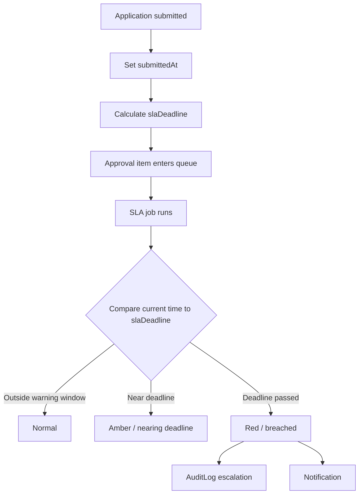
```mermaid
flowchart TD
    A[Application submitted] --> B[Set submittedAt]
    B --> C[Calculate slaDeadline]
    C --> D[Approval item enters queue]
    D --> E[SLA job runs]
    E --> F{Compare current time to slaDeadline}
    F -->|Outside warning window| G[Normal]
    F -->|Near deadline| H[Amber / nearing deadline]
    F -->|Deadline passed| I[Red / breached]
    I --> J[AuditLog escalation]
    I --> K[Notification]
```

The exact warning window, cron frequency, and supervisor hierarchy are not defined in the source material.

---

# 16. Notifications

Model:

```js
{
  _id,
  userId,
  type,
  message,
  read,
  createdAt
}
```

The source only confirms an alert/notification concept; it does not settle whether notifications are:

- In-app only
- Email
- Both

For the MVP, keep the notification service provider-neutral.

---

# 17. Audit Logging

The system has two forms of history.

## Per-application-item history

```js
history: [
  {
    action,
    byUserId,
    byRole,
    reason,
    timestamp
  }
]
```

This gives the user-visible lifecycle of an approval item.

## Global AuditLog

```js
{
  _id,
  actorId,
  actorRole,
  action,
  entityType,
  entityId,
  metadata,
  timestamp
}
```

Use the global audit log for important platform-wide actions such as:

- Authority decisions
- Admin rule changes
- AI calls
- SLA escalation events

Audit entries should be append-only from the application perspective.

---

# 18. API Contract

Base path:

```text
/api/v1
```

---

## 17.1 Auth

| Method | Endpoint | Purpose |
|---|---|---|
| POST | `/auth/register` | Applicant registration |
| POST | `/auth/login` | Login |
| GET | `/auth/me` | Current authenticated user |

### Register

```text
POST /api/v1/auth/register
```

Body:

```json
{
  "name": "Applicant Name",
  "email": "applicant@example.com",
  "password": "..."
}
```

Registration creates an applicant account according to the supplied contract.

### Login

```text
POST /api/v1/auth/login
```

Body:

```json
{
  "email": "applicant@example.com",
  "password": "..."
}
```

Response:

```json
{
  "token": "...",
  "user": {}
}
```

---

# 19. Business Profile API

| Method | Endpoint | Purpose |
|---|---|---|
| POST | `/profile` | Create profile |
| GET | `/profile` | Get current user's profile |
| PATCH | `/profile` | Update profile |

Conceptual fields:

```json
{
  "businessName": "Example Business",
  "sector": "Manufacturing",
  "location": {
    "state": "Maharashtra",
    "district": "..."
  },
  "projectSize": "Small",
  "stage": "..."
}
```

The exact allowed values for `sector`, `projectSize`, and `stage` were not fully defined in the source files.

---

# 20. Checklist API

```text
GET /api/v1/checklist
```

Returns:

```json
{
  "items": [
    {
      "_id": "...",
      "name": "...",
      "department": "...",
      "requiredDocuments": [],
      "slaDays": 0,
      "description": "...",
      "isActive": true
    }
  ]
}
```

The list must be generated from the authenticated applicant's `BusinessProfile`.

---

# 21. Applicant Application APIs

| Method | Endpoint | Purpose |
|---|---|---|
| POST | `/applications` | Create an application from selected approval types |
| GET | `/applications` | List own applications |
| GET | `/applications/:id` | Get own application |
| POST | `/applications/:id/items/:itemId/documents` | Upload document + pre-validation |
| POST | `/applications/:id/submit` | Submit application |
| POST | `/applications/:id/items/:itemId/reupload` | Re-upload after query/rejection |

### Create application

```json
{
  "businessProfileId": "PROFILE_ID",
  "approvalTypeIds": [
    "APPROVAL_TYPE_ID_1",
    "APPROVAL_TYPE_ID_2"
  ]
}
```

### Document upload

Content type:

```text
multipart/form-data
```

Fields:

```text
file
docType
```

Backend should return:

```json
{
  "document": {},
  "preValidationResult": {}
}
```

---

# 22. Authority APIs

| Method | Endpoint | Purpose |
|---|---|---|
| GET | `/authority/applications` | Department-scoped queue |
| GET | `/authority/applications/:id` | View an application |
| GET | `/authority/applications/:id/items/:itemId/risk-brief` | Read/generate risk brief |
| POST | `/authority/applications/:id/items/:itemId/decision` | Make human decision |

Queue supports query parameters defined by the supplied architecture:

```text
?department=&status=&slaRisk=
```

The department must still be enforced from the authenticated authority context. Never trust a client-supplied department filter as an authorization boundary.

### Decision body

```json
{
  "decision": "approve",
  "reason": null
}
```

Supported decisions:

```text
approve
reject
request_reupload
```

A reason is required for:

```text
reject
request_reupload
```

---

# 23. Admin APIs

| Method | Endpoint | Purpose |
|---|---|---|
| GET | `/admin/approval-types` | List approval types |
| POST | `/admin/approval-types` | Create approval type |
| PATCH | `/admin/approval-types/:id` | Update approval type |
| DELETE | `/admin/approval-types/:id` | Delete approval type |
| GET | `/admin/users` | List users |
| GET | `/admin/analytics` | Analytics |

The exact writable/admin fields beyond these contracts should be finalized before implementation.

---

# 24. Application State Machine

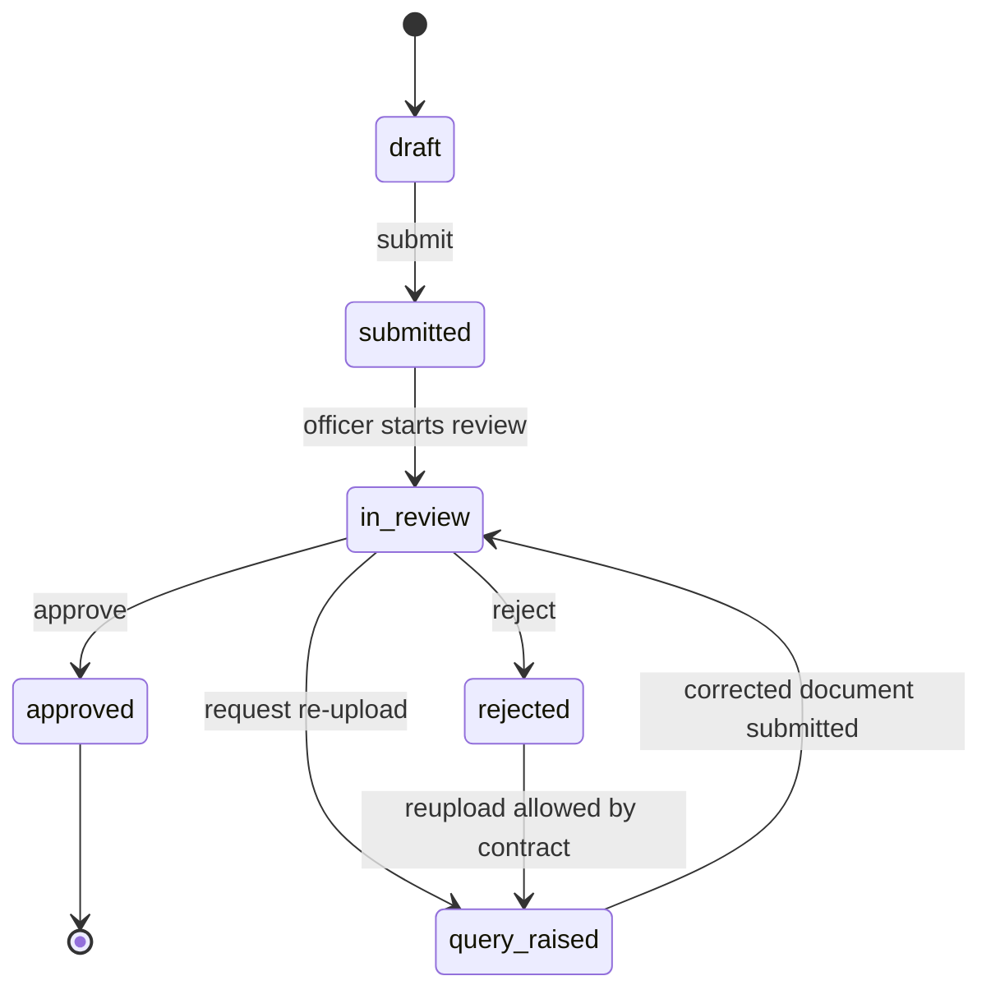
```mermaid
stateDiagram-v2
    [*] --> draft

    draft --> submitted: submit
    submitted --> in_review: officer starts review
    in_review --> approved: approve
    in_review --> rejected: reject
    in_review --> query_raised: request re-upload
    query_raised --> in_review: corrected document submitted
    rejected --> query_raised: reupload allowed by contract
    approved --> [*]
```

Use server-side transition rules. The frontend must not be able to set arbitrary status values.

---

# 25. Overall Status Derivation

The supplied architecture defines overall status as derived from `approvalItems`.

One practical implementation is to centralize the calculation in a service:

```text
calculateOverallStatus(approvalItems)
```

Example reasoning:

```text
All approved
    → approved

Any rejected and no unresolved recovery path
    → rejected

Any query_raised
    → action_required

Some submitted/in_review/draft
    → in_progress
```

**Important:** The exact precedence rules were not explicitly defined in the source documents. Finalize and unit-test them before relying on analytics/dashboard behavior.

---

# 26. Validation and Error Handling

Standard response codes defined by the supplied architecture:

| Code | Meaning |
|---|---|
| 400 | Validation failure |
| 401 | Missing/invalid authentication |
| 403 | Wrong role / ownership / department |
| 404 | Resource not found |
| 409 | Conflict |
| 500 | Unhandled server error |

Validation error shape:

```json
{
  "errors": [
    {
      "field": "email",
      "message": "Invalid email"
    }
  ]
}
```

Server errors should expose only a generic message to clients while logging the detailed server-side error with a correlation ID.

---

# 27. Security Checklist

## Authentication

- Hash passwords with bcrypt
- Never store plain-text passwords
- Verify JWT on protected routes
- Keep the JWT signing secret in environment variables
- Never hard-code secrets in Git

## Authorization

- Check role on every protected route
- Check applicant ownership on every applicant application route
- Check authority department scope on every authority application route
- Check admin role on admin routes

## File handling

- Restrict allowed file types
- Enforce file size limits
- Generate controlled storage names rather than trusting user filenames
- Keep uploads out of Git
- Do not expose storage paths directly if the deployment architecture does not require it

## AI

- Send only the minimum permitted data
- Redact identifying data where required
- Cache risk briefs where appropriate
- Treat AI output as advisory
- Log AI calls

## API

- CORS should allow the deployed frontend origin
- Rate-limit authentication routes
- Validate request bodies
- Return safe error messages

---

# 28. Environment Variables

Based on the supplied backend architecture:

```env
MONGODB_URI=
JWT_SECRET=
JWT_EXPIRES_IN=
AI_PROVIDER=
AI_API_KEY=
PORT=
NODE_ENV=
CORS_ORIGIN=
FILE_STORAGE_PROVIDER=
FILE_STORAGE_PATH=
```

`FILE_STORAGE_*` is provider-dependent because the storage provider was not finalized in the supplied source material.

Example local-development file:

```env
MONGODB_URI=mongodb://localhost:27017/karm
JWT_SECRET=replace_me
JWT_EXPIRES_IN=2h
AI_PROVIDER=
AI_API_KEY=
PORT=5000
NODE_ENV=development
CORS_ORIGIN=http://localhost:5173
FILE_STORAGE_PROVIDER=local
FILE_STORAGE_PATH=./uploads
```

The `2h` value is a **recommendation inherited from the source document's example assumption**, not a confirmed security policy.

---

# 29. Frontend ↔ Backend Contract

Frontend should not implement business rules that belong to the backend.

## Backend owns

```text
Authentication
Authorization
Checklist calculation
Application state transitions
Document validation
SLA calculation
AI risk brief generation
Notifications
Audit logging
Admin rules
```

## Frontend owns

```text
Forms
Navigation
Tables/cards
Upload UI
Dashboard presentation
Loading/error states
Calling backend endpoints
Displaying backend decisions/status
```

### Contract example

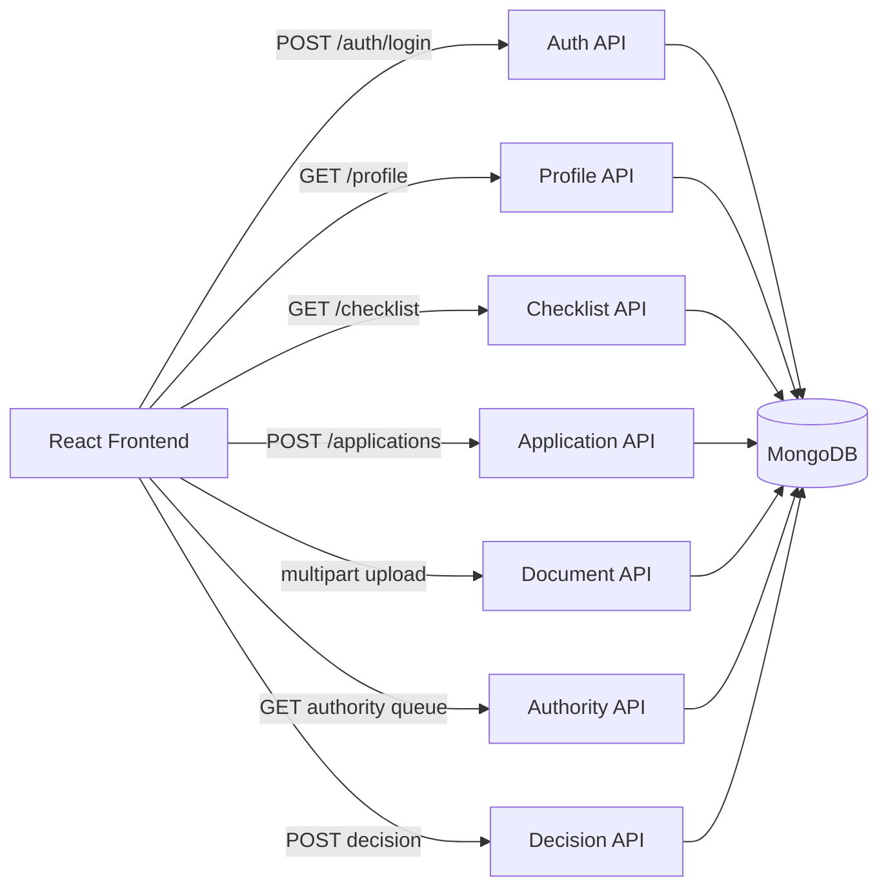
```mermaid
flowchart LR
    FE[React Frontend] -->|POST /auth/login| AUTH[Auth API]
    FE -->|GET /profile| PROFILE[Profile API]
    FE -->|GET /checklist| CHECK[Checklist API]
    FE -->|POST /applications| APP[Application API]
    FE -->|multipart upload| DOC[Document API]
    FE -->|GET authority queue| AUTHQ[Authority API]
    FE -->|POST decision| DEC[Decision API]
    AUTH --> DB[(MongoDB)]
    PROFILE --> DB
    CHECK --> DB
    APP --> DB
    DOC --> DB
    AUTHQ --> DB
    DEC --> DB
```

---

# 30. Recommended HTTP Development Convention

Use:

```text
/api/v1
```

Group routes by domain instead of placing everything in one file.

Example:

```text
/api/v1/auth/*
/api/v1/profile
/api/v1/checklist
/api/v1/applications/*
/api/v1/authority/*
/api/v1/admin/*
```

This matches the supplied API contract and leaves room for future versions.

---

# 31. MongoDB Indexing Recommendations

Indexes are an implementation recommendation and should be added only for fields used by the actual queries.

Likely candidates:

```text
User.email                 unique
BusinessProfile.userId     unique
Application.applicantId
Application.approvalItems.approvalTypeId
Application.approvalItems.assignedOfficerId
Application.approvalItems.status
Application.approvalItems.slaDeadline
ApprovalType.department
ApprovalType.isActive
Notification.userId + read
AuditLog.entityId + timestamp
```

Do not create indexes blindly; verify query patterns first.

---

# 32. Seed Data

`domain-data-seed.md` provides illustrative values.

### Sample sectors

```text
Manufacturing
Food Processing
Textiles
IT/Software Services
Chemicals
Pharmaceuticals
Warehousing/Logistics
Renewable Energy
```

### Sample project sizes

```text
Micro
Small
Medium
Large
```

These are illustrative and not confirmed government taxonomies.

### Sample approval entries

The supplied seed includes examples such as:

```text
Business Registration (Udyam)
Pollution Control Consent (Consent to Establish)
Fire NOC
Factory Licence
Power Connection Clearance
```

These are explicitly labeled illustrative in the seed file.

### Sample checklist mappings

The seed gives demo mappings for sectors such as:

```text
Food Processing
Manufacturing
IT/Software Services
Chemicals
```

Use these only for development/demo data until verified against authoritative Maharashtra sources.

---

# 33. End-to-End Applicant Flow

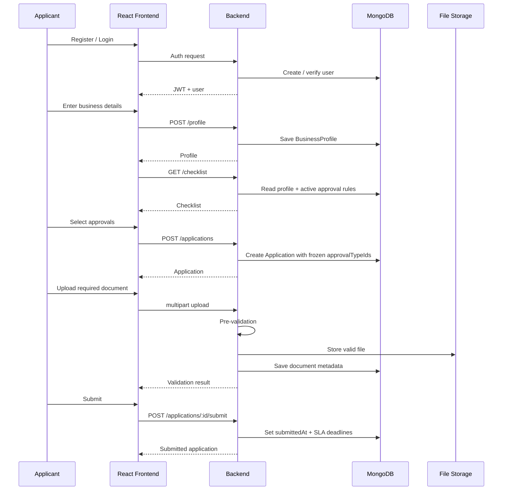
```mermaid
sequenceDiagram
    participant A as Applicant
    participant FE as React Frontend
    participant API as Backend
    participant DB as MongoDB
    participant FS as File Storage

    A->>FE: Register / Login
    FE->>API: Auth request
    API->>DB: Create / verify user
    API-->>FE: JWT + user

    A->>FE: Enter business details
    FE->>API: POST /profile
    API->>DB: Save BusinessProfile
    API-->>FE: Profile

    FE->>API: GET /checklist
    API->>DB: Read profile + active approval rules
    API-->>FE: Checklist

    A->>FE: Select approvals
    FE->>API: POST /applications
    API->>DB: Create Application with frozen approvalTypeIds
    API-->>FE: Application

    A->>FE: Upload required document
    FE->>API: multipart upload
    API->>API: Pre-validation
    API->>FS: Store valid file
    API->>DB: Save document metadata
    API-->>FE: Validation result

    A->>FE: Submit
    FE->>API: POST /applications/:id/submit
    API->>DB: Set submittedAt + SLA deadlines
    API-->>FE: Submitted application
```

---

# 34. End-to-End Authority Flow

```mermaid
sequenceDiagram
    participant O as Authority
    participant FE as React Frontend
    participant API as Backend
    participant DB as MongoDB
    participant AI as AI Provider

    O->>FE: Open authority dashboard
    FE->>API: GET /authority/applications
    API->>API: Verify JWT + authority role
    API->>API: Apply department scope
    API->>DB: Query department queue
    DB-->>API: Applications
    API-->>FE: Queue

    O->>FE: Open application
    FE->>API: GET /authority/applications/:id
    API->>DB: Load application
    API-->>FE: Application

    O->>FE: Open risk brief
    FE->>API: GET /.../risk-brief
    API->>DB: Check cached result

    alt No cached result
        API->>AI: Generate advisory risk brief
        AI-->>API: Score + summary + flags
        API->>DB: Cache risk brief
    end

    API-->>FE: Risk brief

    O->>FE: Decide
    FE->>API: POST /.../decision
    API->>API: Verify role + department
    API->>DB: Update status + history + AuditLog
    API-->>FE: Updated application item
```

---

# 35. SLA Monitoring Flow

```mermaid
sequenceDiagram
    participant JOB as Scheduled SLA Job
    participant DB as MongoDB
    participant N as Notification Service
    participant A as AuditLog

    JOB->>DB: Find submitted/in_review items
    DB-->>JOB: Matching approval items

    loop Each item
        JOB->>JOB: Compare now vs slaDeadline

        alt Nearing deadline
            JOB->>DB: Mark/record SLA warning state
        else Breached
            JOB->>A: Write escalation AuditLog
            JOB->>N: Create Notification
        end
    end
```

The source does not specify the exact scheduler library or warning threshold. Treat both as implementation decisions.

---

# 36. Admin Rules Flow

```mermaid
flowchart TD
    ADMIN[Admin] --> API[Admin API]
    API --> RULES[(ApprovalType collection)]
    RULES --> ENGINE[Checklist Service]
    PROFILE[BusinessProfile] --> ENGINE
    ENGINE --> CHECK[Personalized Checklist]
    CHECK --> APP[Application]
```

Admin changes should affect future checklist calculations, while existing applications retain frozen approval references.

---

# 37. Suggested Backend Package Baseline

The exact packages were not fully finalized in the supplied material.

### Core recommended baseline

```text
express
mongoose
jsonwebtoken
bcrypt
dotenv
cors
multer
```

### Scheduled job

Choose one after team agreement:

```text
node-cron
```

or another scheduler if the deployment requirement justifies it.

### Validation

A schema validation library can be introduced after deciding the team's preferred approach.

**Do not add a large dependency stack just because it is common. Keep the hackathon backend small.**

---

# 38. Suggested Implementation Order

## Phase 1 — Foundation

```text
1. Initialize backend
2. Express server
3. Environment configuration
4. MongoDB connection
5. Error middleware
6. Base /api/v1 routing
```

## Phase 2 — Authentication

```text
7. User model
8. Register
9. Login
10. JWT middleware
11. Role middleware
```

## Phase 3 — Profile + Checklist

```text
12. BusinessProfile model
13. Profile APIs
14. ApprovalType model
15. Seed demo approval types
16. Checklist service
17. GET /checklist
```

## Phase 4 — Applications

```text
18. Application model
19. Create application
20. Applicant list/detail
21. Application state handling
```

## Phase 5 — Documents

```text
22. Multipart upload
23. File storage adapter
24. Pre-validation service
25. Re-upload flow
26. Document metadata persistence
```

## Phase 6 — Authority

```text
27. Authority queue
28. Department scoping
29. Risk brief service
30. Decision endpoint
31. Decision history + AuditLog
```

## Phase 7 — SLA + Notifications

```text
32. SLA deadline calculation
33. Scheduled SLA job
34. Notification records
35. Escalation audit event
```

## Phase 8 — Admin + Analytics

```text
36. Admin approval-type CRUD
37. Admin user listing
38. Analytics aggregation
```

## Phase 9 — Deployment + Testing

```text
39. Dockerfile
40. docker-compose
41. Environment configuration
42. API integration tests
43. Security checks
44. End-to-end demo verification
```

---

# 39. Minimum Viable Demo Path

For SIH demo reliability, the smallest complete backend path should be:

```text
Applicant registration
      ↓
Login
      ↓
Business profile
      ↓
Generated checklist
      ↓
Create application
      ↓
Upload document
      ↓
Pre-validation result
      ↓
Submit
      ↓
Authority queue
      ↓
Risk brief
      ↓
Approve / Reject / Re-upload
      ↓
Applicant sees final status
```

SLA monitoring should run alongside this path.

Avoid starting with analytics, complex AI, or external integrations before the core workflow works.

---

# 40. Testing Strategy

## Unit tests

Test pure business logic:

```text
Checklist matching
Overall status calculation
SLA deadline calculation
Decision transition rules
Document validation rules
```

## Integration tests

Test:

```text
Register → login
Profile creation
Checklist retrieval
Application creation
Ownership enforcement
Department enforcement
Document upload
Submission
Authority decision
Admin approval-type CRUD
```

## Security tests

Explicitly test:

```text
Applicant requesting another applicant's application → 403
Applicant calling authority endpoint → 403
Authority accessing another department → 403
Unauthenticated protected request → 401
Duplicate email/profile → 409
Invalid document → 400
```

---

# 41. Docker Layout

Recommended conceptual deployment:

```mermaid
flowchart LR
    B[Browser] --> FE[Frontend]
    FE --> API[Node.js API Container]
    API --> DB[(MongoDB)]
    API --> FS[File Storage / Mounted Volume]
    API --> AI[Gemini / OpenAI]
```

The supplied PRD confirms Docker deployment, while the backend document describes one API container and MongoDB as either a separate container or managed Atlas instance.

---

# 42. CORS and Deployment

Development:

```text
Frontend: http://localhost:5173
Backend:  http://localhost:5000
```

Production:

```text
CORS_ORIGIN=<deployed frontend origin>
```

Do not use:

```text
*
```

as the production CORS policy unless there is a specific reason and the security impact has been accepted.

---

# 43. What Should NOT Be Implemented as MVP

The PRD explicitly lists these as out of scope:

```text
Payments
E-signature / certificate generation
Multi-language support
Native mobile app
Real (non-sandbox) DigiLocker integration
Common multi-department inspection scheduling
```

Do not add these to the backend scope simply because they could be useful later.

---

# 43. Open Decisions — Must Be Resolved Before Final Production Claims

These items are explicitly unresolved or assumed in the supplied backend document.

| Decision | Current state |
|---|---|
| Express vs Fastify vs NestJS | Express assumed for examples |
| Mongoose vs raw MongoDB driver | Mongoose assumed |
| JWT refresh-token flow | Not specified |
| Exact JWT expiry | Not specified |
| File storage provider | Not specified |
| AI provider | Gemini/OpenAI confirmed; exact choice not final |
| Scheduler library/frequency | Not specified |
| AI redaction method | Not specified |
| Notification channel | Not specified |
| Supervisor hierarchy for escalation | Not specified |
| Controlled vocabulary for sector | Not defined |
| Project-size taxonomy | Not defined |
| Business stage taxonomy | Not defined |
| Exact checklist matching logic | Not defined |
| Admin user-management scope | Not defined |
| Overall-status precedence | Not completely defined |

### Recommended hackathon decisions

For the first working implementation:

```text
Framework       → Express
Mongo layer     → Mongoose
Auth            → JWT + bcrypt
Scheduler       → node-cron
Storage         → local volume for demo, storage adapter for production
AI              → choose one provider and isolate it behind ai-risk.service.js
Notifications   → in-app Notification collection
```

These are implementation recommendations, not facts claimed by the submitted project documents.

---

# 44. Backend Responsibilities for Narendra

This is the practical backend responsibility boundary.

```text
BACKEND
│
├── Server setup
├── Database connection
├── Mongoose models
├── Authentication
├── JWT authorization
├── Role / department / ownership checks
├── Checklist service
├── Application service
├── Document upload + validation
├── SLA calculation / job
├── AI risk-brief integration
├── Notifications
├── Audit logging
├── Admin approval-type APIs
├── Error handling
├── Docker backend setup
└── API documentation
```

The frontend consumes the APIs and presents the workflow. Business rules and security decisions remain server-side.

---

# 45. Frontend ↔ Backend Collaboration Rules

## Rule 1

Agree on API request/response shapes before UI integration.

## Rule 2

Backend owns status transitions.

## Rule 3

Frontend should display backend validation messages rather than rebuilding validation independently.

## Rule 4

Frontend must send the JWT as:

```text
Authorization: Bearer <token>
```

## Rule 5

For uploads:

```text
Content-Type: multipart/form-data
```

## Rule 6

Do not commit:

```text
.env
uploaded documents
API keys
JWT secrets
database credentials
```

---

# 46. Suggested Shared Documentation

Add:

```text
docs/
├── backend-architecture.md
├── api-contract.md
├── database-model.md
└── setup.md
```

The current file can serve as the master handoff and later be split into smaller documents if the team needs them.

---

# 47. Backend Completion Checklist

### Foundation

- [ ] Node project initialized
- [ ] Express server running
- [ ] MongoDB connection working
- [ ] `/api/v1` routing working
- [ ] Central error middleware working
- [ ] Environment variables configured

### Auth

- [ ] Register
- [ ] Login
- [ ] JWT verification
- [ ] `/auth/me`
- [ ] Role middleware
- [ ] Ownership checks
- [ ] Department checks

### Applicant

- [ ] Business profile CRUD
- [ ] Checklist generation
- [ ] Application creation
- [ ] Application listing/detail
- [ ] Document upload
- [ ] Pre-validation
- [ ] Re-upload
- [ ] Submission
- [ ] Status tracking

### Authority

- [ ] Department-scoped queue
- [ ] Application detail
- [ ] Risk brief
- [ ] Approve
- [ ] Reject
- [ ] Request re-upload
- [ ] Decision reason enforcement

### Admin

- [ ] ApprovalType CRUD
- [ ] User listing
- [ ] Analytics endpoint

### Operations

- [ ] SLA deadline calculation
- [ ] Scheduled SLA checks
- [ ] Notifications
- [ ] Audit logging
- [ ] CORS
- [ ] Rate limiting on auth
- [ ] Correlation IDs / logging

### Deployment

- [ ] Dockerfile
- [ ] Docker compose configuration
- [ ] Production env configuration
- [ ] MongoDB deployment strategy
- [ ] File storage strategy
- [ ] AI provider configuration

---

# 48. API Quick Reference

```text
AUTH
POST   /api/v1/auth/register
POST   /api/v1/auth/login
GET    /api/v1/auth/me

PROFILE
POST   /api/v1/profile
GET    /api/v1/profile
PATCH  /api/v1/profile

CHECKLIST
GET    /api/v1/checklist

APPLICANT
POST   /api/v1/applications
GET    /api/v1/applications
GET    /api/v1/applications/:id
POST   /api/v1/applications/:id/items/:itemId/documents
POST   /api/v1/applications/:id/submit
POST   /api/v1/applications/:id/items/:itemId/reupload

AUTHORITY
GET    /api/v1/authority/applications
GET    /api/v1/authority/applications/:id
GET    /api/v1/authority/applications/:id/items/:itemId/risk-brief
POST   /api/v1/authority/applications/:id/items/:itemId/decision

ADMIN
GET    /api/v1/admin/approval-types
POST   /api/v1/admin/approval-types
PATCH  /api/v1/admin/approval-types/:id
DELETE /api/v1/admin/approval-types/:id
GET    /api/v1/admin/users
GET    /api/v1/admin/analytics
```

---

# 49. Final Architecture Decision

For this project, use:

```text
KARM/
│
├── frontend/                 # React + Tailwind
│
├── backend/                  # Node.js + Express
│   ├── src/
│   │   ├── config/
│   │   ├── models/
│   │   ├── controllers/
│   │   ├── routes/
│   │   ├── middleware/
│   │   ├── services/
│   │   ├── utils/
│   │   ├── jobs/
│   │   └── seeds/
│   ├── tests/
│   ├── uploads/
│   ├── Dockerfile
│   └── .env.example
│
├── docs/
├── docker-compose.yml
├── .gitignore
└── README.md
```

```mermaid
flowchart TB
    FE[React + Tailwind Frontend]
    BE[Node.js + Express Backend]
    DB[(MongoDB)]
    AI[Gemini / OpenAI]
    STORE[Document Storage]
    JOB[SLA Job]
    AUDIT[Audit Logs]
    NOTIF[Notifications]

    FE --> BE
    BE --> DB
    BE --> AI
    BE --> STORE
    BE --> AUDIT
    BE --> NOTIF
    JOB --> DB
    JOB --> AUDIT
    JOB --> NOTIF
```

---

# 50. Source Documents Supplied by the Team

The original source files should be retained alongside this handoff:

- `PRD.md`
- `backend-architecture.md`
- `domain-data-seed.md`

The sections above preserve the important requirements and explicitly label assumptions and unresolved decisions.

---

# Appendix A — Original `backend-architecture.md`

<details>
<summary>Open original source</summary>

# backend-architecture.md
Backend handoff for Narendra. Node.js + MongoDB only — Django/Python are explicitly removed per team decision.

## 1. Stack Assumptions
- Runtime: Node.js
- Web framework: `[NEEDS DECISION: Express, Fastify, or NestJS was never specified. This document assumes Express for all route examples since it's the most common Node+Mongo pairing and requires the least boilerplate for a hackathon timeline — swap freely.]`
- DB layer: MongoDB via Mongoose `[NEEDS DECISION: raw MongoDB driver vs Mongoose was not specified; Mongoose assumed below for schema validation.]`
- Auth: JSON Web Tokens (`jsonwebtoken`) + password hashing (`bcrypt`)
- Scheduled jobs: `node-cron` or `agenda` for SLA checks `[NEEDS DECISION: exact library/frequency]`
- File storage: `[NEEDS DECISION: local disk vs S3-compatible object storage was never specified. Given Docker deployment is confirmed, object storage is recommended, but not decided.]`
- AI provider: Gemini or OpenAI API (confirmed in source material; exact provider `[NEEDS DECISION]`)

## 2. Roles & Access Control
Three roles, carried in the JWT payload: `applicant`, `authority`, `admin`. Authority accounts carry a `department` field; an authority can only access applications routed to their department. Applicants can only access records where `applicantId` matches their own user id. Enforce both checks server-side on every route, not just in the frontend.

## 3. Data Models (Mongoose schema shape)

### User
```
{
  _id, name, email (unique), passwordHash,
  role: enum[applicant, authority, admin],
  department: string | null,   // required if role=authority or admin
  phone: string | null,        // [NEEDS DECISION: required or optional]
  createdAt, updatedAt
}
```

### BusinessProfile
```
{
  _id, userId (ref User, unique per applicant),
  businessName: string,
  sector: string,       // [NEEDS DECISION: controlled vocabulary not defined; see domain-data-seed.md for illustrative values]
  location: { state: string, district: string },
  projectSize: string,  // [NEEDS DECISION: e.g. micro/small/medium/large — not defined by source]
  stage: string,        // [NEEDS DECISION: e.g. new/expansion — not defined by source]
  createdAt, updatedAt
}
```

### ApprovalType (rules-engine entry, admin-managed)
```
{
  _id, name: string, department: string,
  requiredDocuments: [{ docType: string, label: string, required: boolean }],
  slaDays: number,
  description: string,
  isActive: boolean,
  createdAt, updatedAt
}
```

### Application
```
{
  _id, applicantId (ref User), businessProfileId (ref BusinessProfile),
  approvalItems: [{
    _id,
    approvalTypeId (ref ApprovalType),
    status: enum[draft, submitted, in_review, query_raised, approved, rejected],
    assignedOfficerId: ref User | null,
    submittedAt: Date | null,
    slaDeadline: Date | null,       // computed = submittedAt + approvalType.slaDays
    documents: [{
      docType: string, fileUrl: string, uploadedAt: Date,
      preValidationStatus: enum[pending, passed, failed],
      preValidationNotes: [string],
      riskBrief: { score: number, summary: string, flags: [string], generatedAt: Date } | null
    }],
    history: [{ action: string, byUserId: ref User, byRole: string, reason: string | null, timestamp: Date }]
  }],
  overallStatus: enum[draft, in_progress, action_required, approved, rejected], // derived from approvalItems
  createdAt, updatedAt
}
```
Checklist snapshot decision: `[NEEDS DECISION resolved as an assumption]` — the checklist is computed live from BusinessProfile against active ApprovalType rules for display, but once an Application is created, the chosen `approvalTypeId`s are frozen on that application so later rule edits don't retroactively change an in-flight application's requirements.

### Notification
```
{ _id, userId, type: string, message: string, read: boolean, createdAt }
```
`[NEEDS DECISION: in-app only, email only, or both — source material does not specify delivery channel scope beyond "alerts"]`

### AuditLog (global, append-only, separate from per-item `history`)
```
{ _id, actorId, actorRole, action, entityType, entityId, metadata: object, timestamp }
```

## 4. API Contract (base path `/api/v1`)

### Auth
| Method | Path | Body | Response | Notes |
|---|---|---|---|---|
| POST | `/auth/register` | `{name, email, password}` | `{user}` | applicant role only |
| POST | `/auth/login` | `{email, password}` | `{token, user}` | |
| GET | `/auth/me` | — | `{user}` | requires bearer token |

Token expiry: `[NEEDS DECISION: no refresh-token flow was specified; assume a single access token with a reasonable expiry (e.g. 2h) and silent re-login on expiry for the hackathon build — flag as a hardening gap for production.]`

### Business Profile
| Method | Path | Body | Response |
|---|---|---|---|
| POST | `/profile` | profile fields | `{profile}` |
| GET | `/profile` | — | `{profile}` |
| PATCH | `/profile` | partial fields | `{profile}` |

### Checklist
| Method | Path | Response |
|---|---|---|
| GET | `/checklist` | `{items: ApprovalType[]}` — computed from the caller's BusinessProfile |

### Applications — Applicant
| Method | Path | Body | Response |
|---|---|---|---|
| POST | `/applications` | `{businessProfileId, approvalTypeIds: [id]}` | `{application}` |
| GET | `/applications` | — | `{applications: [...]}` (own only) |
| GET | `/applications/:id` | — | `{application}` |
| POST | `/applications/:id/items/:itemId/documents` | multipart file + `{docType}` | `{document, preValidationResult}` — runs pre-validation synchronously |
| POST | `/applications/:id/submit` | — | `{application}` — sets status=submitted, sets slaDeadline per item |
| POST | `/applications/:id/items/:itemId/reupload` | multipart file | `{document}` — only allowed when item status is `query_raised` or `rejected` |

### Applications — Authority
| Method | Path | Query/Body | Response |
|---|---|---|---|
| GET | `/authority/applications` | `?department=&status=&slaRisk=` | `{applications: [...]}` scoped to officer's department |
| GET | `/authority/applications/:id` | — | `{application}` |
| GET | `/authority/applications/:id/items/:itemId/risk-brief` | — | `{riskBrief}` — triggers AI call if not cached, else returns cached |
| POST | `/authority/applications/:id/items/:itemId/decision` | `{decision: approve\|reject\|request_reupload, reason}` | `{applicationItem}` — reason required for reject/request_reupload |

### Admin
| Method | Path | Body | Response |
|---|---|---|---|
| GET/POST | `/admin/approval-types` | — / ApprovalType fields | list / created entry |
| PATCH/DELETE | `/admin/approval-types/:id` | partial fields / — | updated entry / 204 |
| GET | `/admin/users` | — | `{users}` — `[NEEDS DECISION: scope of fields/actions beyond listing]` |
| GET | `/admin/analytics` | — | `{avgDaysByApprovalType, bottlenecks, rejectionReasons}` |

## 5. Pre-Validation Logic (synchronous, runs on document upload)
Confirmed scope from source material: file type check, file size limit, expiry-date check, required-field presence. Exact implementation (OCR vs filename/metadata heuristics) is `[NEEDS DECISION: not specified beyond "instant pre-validation" in the presentation]`. Return field-level `preValidationNotes` immediately so the frontend can show inline errors before submission.

## 6. AI Risk Brief
On request (or triggered at submission), send extracted document metadata to the configured AI provider; store the returned `{score, summary, flags}` on the document subdocument. Per the DPDP Act 2023 principle cited in the presentation's own references, redact personally identifying raw document content before sending to the external API — `[NEEDS DECISION: exact redaction method not specified]`. The AI output is advisory only; it must never auto-approve or auto-reject — only a human `decision` call can change item status.

## 7. SLA Engine
A scheduled job (`[NEEDS DECISION: exact cron frequency]`) scans `approvalItems` with `status in [submitted, in_review]`, compares `now` to `slaDeadline`, and:
- flags items within a configurable "nearing deadline" window (amber)
- flags items past `slaDeadline` as breached (red) and writes an `AuditLog` escalation entry + a `Notification` to the assigned officer's supervisor `[NEEDS DECISION: supervisor hierarchy/escalation target not defined by source material]`

## 8. Error Handling (standard across all routes)
| Status | When |
|---|---|
| 400 | validation failure — return `{errors: [{field, message}]}` |
| 401 | missing/invalid token |
| 403 | valid token, wrong role or ownership mismatch |
| 404 | resource not found |
| 409 | conflict (e.g. duplicate profile) |
| 500 | unhandled — return a generic message, log full detail server-side with a correlation id |

## 9. Operational Concerns
- Env vars: `MONGODB_URI`, `JWT_SECRET`, `JWT_EXPIRES_IN`, `AI_PROVIDER`, `AI_API_KEY`, `PORT`, `NODE_ENV`, `CORS_ORIGIN`, `FILE_STORAGE_*` (provider-dependent, pending decision above)
- CORS: restrict to the deployed Lovable frontend origin
- Rate limiting on `/auth/*` routes
- Logging: `[NEEDS DECISION: pino/winston/other not specified]` — at minimum log every decision action and every AI call with a correlation id
- Deployment: Docker confirmed by source material; one container for the API, MongoDB as a separate service (container or managed Atlas instance — `[NEEDS DECISION]`)


</details>

---

# Appendix B — Original `PRD.md`

<details>
<summary>Open original source</summary>

# PRD.md — KARM (SIH26130)
Grounded entirely in the submitted SIH presentation and the project's prior design conversation. Use this as context for any other AI model/platform working on this project.

## 1. Problem Statement (verbatim, as submitted)
SIH26130 — "Efficiency in streamlining industrial approvals, compliance processes, and access to government support services." Issued by the Government of Maharashtra. Theme: Miscellaneous. Category: Software.

## 2. Problem Summary
Entrepreneurs and industrial units in Maharashtra must obtain many registrations, permissions, licences, NOCs, inspections and renewals from different departments. Applicants struggle to know which approvals apply, what documents are needed, and where their file is stuck. Departments face incomplete applications, repetitive scrutiny, manual coordination and no visibility into bottlenecks.

## 3. Solution Summary (as submitted)
KARM is a dual-portal platform:
- **Applicant Portal:** personalized checklist of required approvals/licences/NOCs based on sector, location and project size; guided document upload with instant pre-validation; a live "Days Pending Approval" tracker on every application until resolved.
- **Authority Portal:** review, approve, reject, or request re-upload, assisted by a layered document trust check (metadata scan + AI risk brief) before human review.

## 4. Users & Roles
| Role | Who | Core needs |
|---|---|---|
| Applicant | Entrepreneurs, startup owners, industrial units | Know what's required, submit cleanly, track status |
| Authority | Government reviewing officers (department-scoped) | Review efficiently, trustworthy risk signals, clear SLA visibility |
| Department Admin | Department-level service and authority managers | Configure department workflows and monitor applications |
| Admin | Platform/rules administrators | Keep approval rules current, manage users |

## 5. Functional Requirements (from submitted material)
1. Personalized checklist generated from a rules engine (not a static list), based on sector/location/project size.
2. Guided document upload with instant pre-validation before submission.
3. Live SLA clock ("Days Pending Approval") on every application, visible until resolution, with automatic escalation on breach.
4. Authority review actions: approve, reject (with reason), request re-upload (with reason).
5. Document trust layer: metadata scan + AI-generated risk brief surfaced to the officer. AI assists; it never makes the final decision — a human officer always decides.
6. Role-based access: applicants see only their own applications; authorities see only their department's queue.
7. Admin-managed rules engine so approval requirements can be updated without a code change.

## 6. 4-Step Core Flow (as submitted)
Apply → Validate → Review → Track
- **Apply:** entrepreneur enters business details, receives an auto-generated checklist.
- **Validate:** guided upload with instant pre-validation, reducing incomplete applications.
- **Review:** officer sees an AI-assisted risk brief, then approves / rejects / requests re-upload.
- **Track:** live SLA clock and dashboard remain visible until final approval.

## 7. Non-Functional / Design Requirements
- Professional, practical, accessible interface for government staff and entrepreneurs — not an aesthetic-first or trendy UI. No glassmorphism or similar effects.
- User-selectable dark theme: restrained dark grey/black, Discord 2022–24-inspired, not pure black.
- Light theme: low contrast but readable, a polished, enhanced take on familiar Indian government-site conventions rather than a reproduction of their usability or visual shortcomings.
- Full flow — registration/login through to approval or service request — must function end to end, not be partially stubbed.

## 8. Feasibility (as submitted)
Built entirely on mature, well-documented tools; no specialized hardware or private dataset required; core MVP achievable within hackathon timeframe using standard workflow logic.

## 9. Risks & Mitigations (as submitted)
| Risk | Mitigation |
|---|---|
| Getting official DigiLocker integration access | Use a DigiLocker sandbox/mock flow for the prototype; apply for real access later |
| Keeping approval rules updated as regulations change | Admin-managed rules engine so departments can update checklist rules directly |
| AI risk flags wrongly blocking genuine applicants | AI only flags risk; a human officer always makes the final decision |

## 10. Impact & Benefits (as submitted)
- **Entrepreneurs:** clear guidance, fewer rejections, one dashboard for all approvals.
- **Government departments:** organized applications, visible bottlenecks, less repetitive scrutiny.
- **Social:** builds public trust in government processes through transparency.
- **Economic:** faster approvals mean faster business setup and job creation.
- **Governance:** structured digital data replaces scattered manual files.
- **Environmental:** faster clearances also speed up green and sustainable projects.

## 11. Confirmed Tech Stack (as submitted, post team discussion)
Frontend: React.js + Tailwind CSS. Backend: Node.js (Django/Python explicitly removed). Database: MongoDB (PostgreSQL explicitly removed). Auth: JWT with role-based access (Applicant, Authority, Admin). AI layer: Gemini/OpenAI API for document risk summaries and checklist explanations. Deployment: Docker.

## 12. References (as submitted)
- maitri.gov.in — Maharashtra's existing single-window portal for industrial approvals; KARM is positioned as an intelligent layer on top of it, not a replacement.
- Maharashtra Industry, Trade and Investment Facilitation Act, 2023 — legal basis for the state's single-window clearance system.
- digilocker.gov.in / API Setu (apisetu.gov.in) — referenced for the document verification pipeline.
- data.gov.in — Open Government Data platform, referenced for transparency standards.
- Digital Personal Data Protection Act, 2023 — referenced for data privacy principles followed in the design.
- Note: the submitted deck also still lists "Django REST Framework official documentation" as a reference. This is stale since the team moved to Node.js and is flagged here, not corrected, since this PRD must not alter what was actually submitted.

## 13. Explicitly Out of Scope for MVP
Not specified as in-scope anywhere in the source material: payments, e-signature/certificate generation, multi-language support, native mobile app, real (non-sandbox) DigiLocker integration, common multi-department inspection scheduling. Treat these as future-phase only.

## 14. Open Decisions
See every `[NEEDS DECISION: ...]` marker in `backend-architecture.md` and `lovable-master-prompt.md` — these are the gaps the source material does not resolve. They are intentionally not guessed here.


</details>

---

# Appendix C — Original `domain-data-seed.md`

<details>
<summary>Open original source</summary>

# domain-data-seed.md
Why this file exists: `backend-architecture.md`'s `ApprovalType` collection and `lovable-master-prompt.md`'s checklist screen both need *some* data to run and demo against, but the source material never defined a real approval taxonomy — that was correctly flagged as `[NEEDS DECISION]` in both files. This file is illustrative seed data only, written for demo/dev purposes, NOT verified government regulatory content. Do not present these as authoritative legal requirements — verify against maitri.gov.in before using any of this in a real submission or demo claim.

## Sample Sectors (for BusinessProfile.sector)
Manufacturing, Food Processing, Textiles, IT/Software Services, Chemicals, Pharmaceuticals, Warehousing/Logistics, Renewable Energy

## Sample Project Sizes (for BusinessProfile.projectSize)
Micro, Small, Medium, Large *(illustrative MSME-style banding, not a confirmed taxonomy)*

## Sample ApprovalType Seed Entries
```json
[
  {
    "name": "Business Registration (Udyam)",
    "department": "MSME",
    "slaDays": 7,
    "requiredDocuments": [
      { "docType": "pan_card", "label": "PAN Card", "required": true },
      { "docType": "address_proof", "label": "Address Proof", "required": true }
    ],
    "description": "Illustrative example entry — verify real requirements before demo use."
  },
  {
    "name": "Pollution Control Consent (Consent to Establish)",
    "department": "Maharashtra Pollution Control Board",
    "slaDays": 21,
    "requiredDocuments": [
      { "docType": "site_plan", "label": "Site Layout Plan", "required": true },
      { "docType": "project_report", "label": "Project Report", "required": true }
    ],
    "description": "Illustrative example entry — verify real requirements before demo use."
  },
  {
    "name": "Fire NOC",
    "department": "Fire Department",
    "slaDays": 15,
    "requiredDocuments": [
      { "docType": "building_plan", "label": "Building Plan", "required": true },
      { "docType": "fire_safety_cert", "label": "Fire Safety Equipment Certificate", "required": false }
    ],
    "description": "Illustrative example entry — verify real requirements before demo use."
  },
  {
    "name": "Factory Licence",
    "department": "Directorate of Industrial Safety and Health",
    "slaDays": 30,
    "requiredDocuments": [
      { "docType": "site_plan", "label": "Factory Layout Plan", "required": true },
      { "docType": "proof_of_ownership", "label": "Proof of Premises Ownership/Lease", "required": true }
    ],
    "description": "Illustrative example entry — verify real requirements before demo use."
  },
  {
    "name": "Power Connection Clearance",
    "department": "MSEDCL",
    "slaDays": 10,
    "requiredDocuments": [
      { "docType": "load_requirement", "label": "Load Requirement Document", "required": true }
    ],
    "description": "Illustrative example entry — verify real requirements before demo use."
  }
]
```

## Sample Mapping Logic (for the checklist "rules engine")
`[NEEDS DECISION: the real matching logic — e.g. sector-to-approval-type rules — was not defined anywhere in the source material.]` For a demoable MVP, a simple illustrative rule table is enough:

| Sector | Suggested ApprovalType names |
|---|---|
| Food Processing | Business Registration (Udyam), Fire NOC, Factory Licence, Power Connection Clearance |
| Manufacturing | Business Registration (Udyam), Pollution Control Consent, Factory Licence, Power Connection Clearance |
| IT/Software Services | Business Registration (Udyam) |
| Chemicals | Business Registration (Udyam), Pollution Control Consent, Fire NOC, Factory Licence |

This table is a seed for demo purposes. In production, Admins would maintain this mapping through `/admin/approval-types`, per `backend-architecture.md` Section 4.


</details>
